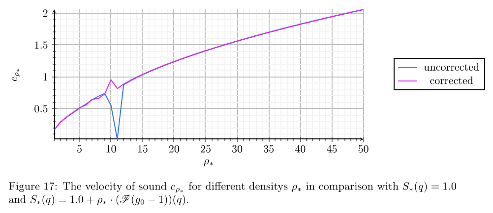
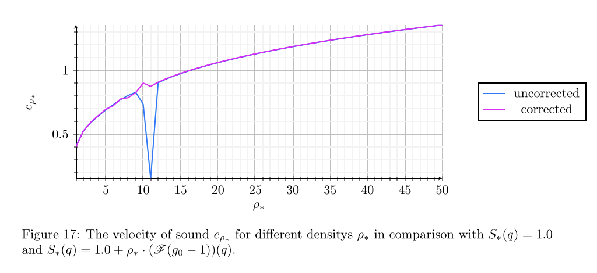

# BA24-CorDis
Code Base to the bachelor's thesis "Studies of ERM Models with Correlated Disorder". It holds the code to simulate the ERM models with correlated disorder using Born approximation, as well as the final version of the thesis as a PDF file. It corresponds to the print version of the thesis, which is available at the University of Constance. Its reference is:

```
    BA2024-StudiesOfERMmodelswithcorrelateddisorder Final.pdf
```

## Table of Contents
1. [Structure](#structure)
2. [Usage](#usage)
3. [Corrections](#corrections)
4. [Known Mistakes](#known-mistakes)


### Structure
The main contents of the thesis are held in:
```
    Bachelorarbeit/Inhalt/Sektionen
```
It contains the text files for each section of the thesis and uses references to several other folders. I assume the folder titles to be self-explanatory. Numerical results are stored in:
```
    Bachelorarbeit/Inhalt/Numerik
```
Hereby `Cor-S-SOS-Comp` contains results for the Heaviside approach presented in section 4, `Cor-S-exp-SOS-Comp` stores the respective exponential approach. Since a cruical mistake has been done in the simulation, the _corrected_ results have the attribute `*Cor*` in their name. They both contain numerical results for $k\mapsto S(k) = 1.0$ and $k\mapsto S(k) = 1.0 + \mathcal{F}(g - 1)(k)$. The naming convention is as follows:
```
    DENSITY - GRID SIZE - MAX k - SPRING FUNCTION APPROACH .csv
```
There are logs provided which contain information about the computation time and the parameters used for the `Simulation/runsim.sh` script, as well as norm values for every iteration of the fixed point solver involved in the Dyson equation. 

### Usage
The LaTeX project files requires a package containing several customizations I have made. It is not publicly available at the moment. Therefore the user is advised to use the provided PDF file. 

The numerical results can reproduced by running the `Simulation/runsim.sh` script. Needed packages for the julia simulation can be checked and installed via `Simulation/PackageCheck.jl`. For the fixed point solver multithreading is recommended. It can be activated using the `-t` flag in the `runsim.sh` script.

### Corrections
The final version of the thesis that was used for the print version might contain mistakes. Since the project formally is completed, any corrections made will be stored in the `Bachelorarbeit` folder. To access the original LaTeX code please see the commit on august 8th, 2024 with the hash
```
    2611f066b6d9c5a104089db123ca1d1eb520cbe4
```

### Known Mistakes
- The calculation of the velocity of sound contains a second root, i.e. the mean over $q\mapsto ((D_{\rho_\ast}(q))^{0.5}/q)^{0.5}$ was calculated. Obviously this does not represent local derivatives, such that a corrected version should follow
$$c(\rho_\ast) := \underset{q\in G_q}{\text{mean}}\left(\sqrt{D_{\rho_\ast}(q)}/q\right),$$

  while faulty calculations were based on 
$$c_{\text{faulty}}(\rho_\ast) := \underset{q\in G_q}{\text{mean}}\left(\left(\sqrt{D_{\rho_\ast}(q)}/q\right)^{0.5}\right).$$

  This mistake is present in the print version of the thesis. It is fixed in the Code Base within the file `Bachelorarbeit/Inhalt/Numerik/Schallgeschwindigkeit_Modul_fixed.jl`. Since $x\mapsto \sqrt{x}$ is a monotonically increasing function, the mistake only changes "the form" of the velocity's graphs around $1$, but keeps near $1$ behaviour. This directly affects figures 17 and 21 and is corrected for commits after august 12th. One can see the change in an example on figure 17:

compared to the faulty calculation:

So thankfully, general results stay the same, but velocity amplitudes change with $((D_{\rho_\ast}(q))^{0.5}/q)^{0.5} \geq \sqrt{D_{\rho_\ast}(q)}/q$ for $q < 1$ and reversed for $q > 1$. The new data can be seen in `Bachelorarbeit/Inhalt/Numerik/Cor-S-SOS-Comp/VelocityOfSound-S-fixed.csv` and compared to the old data `Bachelorarbeit/Inhalt/Numerik/Cor-S-SOS-Comp/VelocityOfSound-S.csv`.